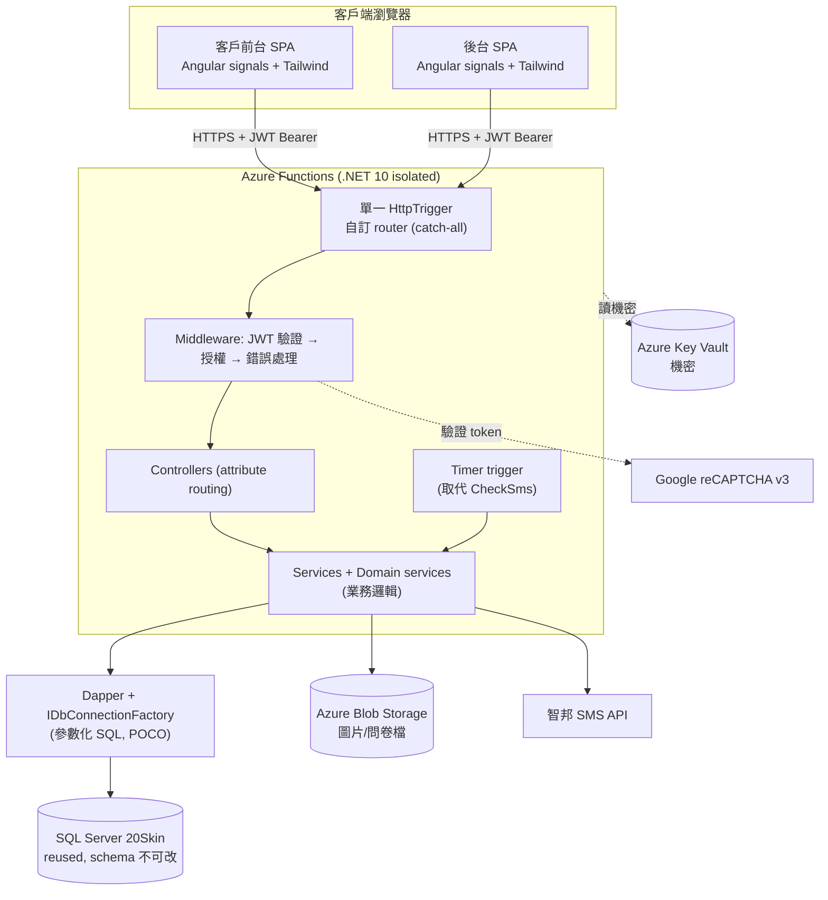

> 新系統架構。舊 6 專案分層見 [old/architecture.md](old/architecture.md)。

## 整體拓樸

## 分層

| 層 | 內容 | 職責 | 不負責 |
|---|---|---|---|
| **Presentation（兩 SPA）** | Angular components / signal stores / guards / interceptors | 畫面、前端狀態、表單驗證、呼叫 API | 業務規則、DB |
| **API Host** | HttpTrigger + 自訂 router + middleware | 路由分派、JWT 驗證、授權、model binding、回應序列化 | 業務邏輯細節 |
| **Controllers** | 各功能 controller + attribute routing | HTTP 入口、組裝 request/response DTO | 跨表業務、DB 細節 |
| **Services / Domain** | 業務服務 + Domain services | 跨表業務、必保留邏輯（容量/編號/重複/簡訊）、交易邊界 | HTTP、序列化 |
| **Data** | Dapper（`IDbConnectionFactory` + POCO + 參數化 SQL）| 資料存取、查詢 | 業務邏輯 |
| **Infra** | Blob / Key Vault / SMS client / JWT provider | 外部整合封裝 | 業務決策 |

- 上層只依賴下層，不反向引用。
- 兩個 SPA 不互相依賴、不共用程式碼（兩獨立專案）。
- Timer trigger 與 HttpTrigger 共用 Services（同一 Functions 專案）。

## 與舊系統對照

| 舊 | 新 |
|---|---|
| `20Skin`（前台 MVC + Razor） | 客戶前台 Angular SPA |
| `20SkinBackend`（後台 MVC + SmartAdmin） | 後台 Angular SPA |
| `20Skin.Service`（BaseService/各 Service） | API 的 Services / Domain services |
| `20Skin.Models`（EF6 edmx + GenericRepository） | `Skin.Data`：Dapper + POCO（移除 DbContext/GenericRepository） |
| `20Skin.Libs`（Definition 常數） | API Core/Constants |
| `CheckSms`（console + 外部排程） | Azure Functions Timer trigger |
| Session（IsLogin/MemberID/AdminID/AdminLims） | JWT claims + 前端 signal store |
| Web API `UploadsController` + `~/Upload` | Blob Storage + 上傳端點 |

## 執行邊界

| 進程 | 載體 | Session/狀態 |
|---|---|---|
| 客戶前台 SPA | Azure Static Web Apps（靜態） | 無 server session；JWT 存瀏覽器、reservation 存 signal store |
| 後台 SPA | Azure Static Web Apps（靜態，獨立站） | 同上；權限存 JWT claims |
| API | Azure Functions（無狀態） | 無 session；每請求驗 JWT；refresh 狀態存 reused DB 之外 |

## 自訂 router MVC（API 核心概念）

單一 catch-all HttpTrigger 接全部 `/api/{*path}`，自訂 router 以反射建立 controller/action 路由表，依 HTTP method + path + attribute routing 分派，middleware pipeline 處理 JWT/授權/錯誤/序列化。細節見 [design/api-design.md](design/api-design.md) 與 [design/backend-design.md](design/backend-design.md)。

## Frontmatter Schema

每份 `docs/**/*.md` 須含 frontmatter，schema 定義沿用 [old/architecture.md](old/architecture.md) §Frontmatter Schema（`title / purpose / applicable_when / related_agents / related_docs / keywords / last_updated / status`）。
